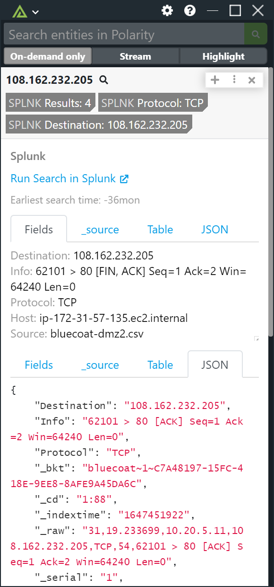
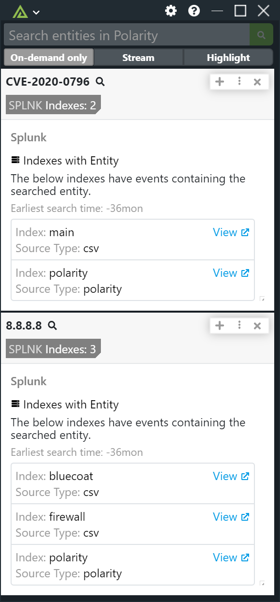

# Polarity Splunk Integration

Polarity's Splunk integration allows a user to connect and search a Splunk Enterprise or Splunk Cloud instance with a customized search string.  Additionally, the integration supports running an "Index discovery" metasearch (see Index Discovery section below), as well as Splunk KVStore data.

|  |
|---|---|
|*Custom Search Query* |*Index Discovery metasearch*|

## Required: Enabling Token Authentication

The Polarity-Splunk integration works best with Token Authentication enabled on your Splunk Enterprise instance.  By default, token authentication is turned off for new installations of Splunk Enterprise. For directions on how to enable Token Authentication please see the following Splunk help page.

> https://docs.splunk.com/Documentation/Splunk/9.0.1/Security/EnableTokenAuth

To use your Splunk Cloud deployment you must submit a case requesting REST API access using the [Splunk Support Portal](https://login.splunk.com/en_us/?module=roles&func=showloginform&redirecturl=https%3A%2F%2Fwww.splunk.com%2Fpage%2Fsso_redirect%3Ftype%3Dportal%26resume%3D%2Fidp%2Fs3HZp%2FresumeSAML20%2Fidp%2FSSO.ping%26spentity%3Dhttps%3A%2F%2FPROD_SupportPortal_ExistingContact). 

> https://docs.splunk.com/Documentation/Splunk/9.0.1/RESTTUT/RESTandCloud

## Splunk Integration Options

### Base Splunk URL

The base URL for the Splunk REST API including the scheme (i.e., https://) and port (e.g., https://mysplunk:8089)  The URL for the Splunk
REST API will be different than the Splunk Web UI which defaults to port 9000.

Example REST API URL:

```
https://splunk.dev:8089
```

> The default port for the Splunk REST API is 8089.

### Splunk Search App URL

The URL for the Splunk Search App including schema (i.e., https://) and port (e.g., https://mysplunk:9000/en-US/app/search/search). This option must be set to "User can view only" (rather than "Only admins can view and edit").  This setting is used to make a clickable link in the Overlay Window that will take you to the Splunk search interface.

> It is important that this setting is set to "User can view only".  This is required so the option is available to non-admin users in their Overlay Window.

### Splunk Username

Valid Splunk username. Leave this field blank if authenticating via a Splunk Authentication Token.

### Splunk Password

Valid Splunk password corresponding to the username specified above. Leave this field blank if authenticating via a Splunk Authentication Token.

### Splunk Authentication Token

A Splunk Authentication Token which can be created from the Splunk web interface by going to "Settings -> Tokens".

### Search Type

Select the type of search that will be run. There are three types of searches:

#### Custom SPL Search

The "Custom SPL Search" runs a user provided SPL query and displays results. Review options 1, 2, 3, 4 and 5 if selecting this search type.

#### Index Discovery Search

The "Index Discovery Search" runs a metasearch that will return a list of indexes where the searched entity exists. Review options 1, 4, 5, 6, and 7 if selecting this search type.

By default, the exact metasearch query run by the integration is as follows:

```
| metasearch index=* earliest={{time-bounds}} TERM({{ENTITY}}) 
| dedup index, sourcetype    
| stats values(sourcetype) AS sourcetype by index    
| mvexpand sourcetype    
| eval index=index, sourcetype=sourcetype
| table index, sourcetype
```

Note that this search uses the TERM directive to more efficiently search indexed terms.  As a result, it will not find non-indexed entities. If you'd like to override this behavior you can modify the match query by modifying the `8. Index Discovery Search - Index Discovery Match Query` option.

For each returned index/sourcetype, the integration will provide a link that will take you to the Splunk search app with a pre-populated search for the entity in question.  The default pre-populated search app search has the form:

```
index={{index}} sourcetype={{sourcetype}} TERM(8.8.8.8)
```

If you provide a value for option `8. Index Discovery Search - Index Discovery Match Query`, then this match query will be used to create the search app link.

The value of the `1. Earliest Time Bounds` option will be applied to the metasearch.

#### KV Store Search

The "KV Store Search" will search the specified KV Store collection for the given entity. Review options 1 and 8 if selecting this search type. 

### 1. Earliest Time Bounds

Sets the earliest (inclusive) time bounds for the `Custom SPL Search` and  `Index Discovery Search` search types. If set, this option will override any time bounds set in the `2. Custom SPL Search - Splunk Search String` option. Leave blank to only use time bounds set via the `2. Custom SPL Search - Splunk Search String` option. 

> This option should be set to "Users can view only". 

Defaults to `-1mon`.

Common examples include

* `-6mon`: last 6 months
* `-1mon`: last month
* `-7d`: last 7 days
* `-4h`: last 4 hours

### 2. Custom SPL Search - Splunk Search String

Splunk Search String to execute. The string `{{ENTITY}}` will be replaced by the looked up indicator.

For example, to search the `proxy` index you might use a query like this:

```
search index=proxy srcIp=TERM({{ENTITY}}) | head 10
```

**IMPORTANT**: Since the integration leverages bulk searching, it is important that each returned row contain the entity value that is being looked up. This allows the integration to match returned records with the related entity.  For typical search queries this will automatically be the case.  However, for queries such as `tstats` or `metasearch` you may need to ensure that the entity is inserted into the returned records.  A simple way to do this is by appending the `eval` command to the end of the search:

```
| eval entity="{{ENTITY}}"
```

This will ensure each returned row include an `entity` property with the value of the entity being searched.

Custom SPL searches also support running `metasearch`, `tstats`, `inputlookup` and macros.

#### metasearch

Metasearch example:

```
| metasearch index=polarity TERM({{ENTITY}}) | eval entity="{{ENTITY}}" | head 10
```

#### tstats 

The following tstats example will return the first and last time a particular entity was seen as well as a total count across all indexes. 

```
| tstats min(_time) as first_seen, max(_time) as last_seen, count where index=* AND TERM({{ENTITY}}) by index, sourcetype | convert ctime(first_seen) ctime(last_seen) | stats values(index), values(sourcetype), min(first_seen),max(last_seen),sum(count) | rename values(index) as indexes, values(sourcetype) as sourcetypes | eval entity="{{ENTITY}}"
```

#### inputlookup

inputlookup example:

```
| inputlookup kvstorecoll_lookup where (Port=443) AND (SourceIP="{{ENTITY}}") | head 10
```

#### When to use the TERM Directive

Note the use of the `TERM` directive can allow for more efficient searching of indicators such as IP addresses.

The TERM directive can be used to speed up your search when the entity to search meets the following conditions:

* The entity contains minor breakers, such as periods or underscores (e.g., the periods in an IP address)
* The entity is bound by major breakers in the data (i.e., spaces, commas, semicolons, question marks, parentheses, exclamation points, and quotation marks)
* The entity does not contain major breakers

As an example of where the TERM directive will not work is if your data has the following format:

```
src=8.8.8.8 
```

In this example, the equal (=) symbol is a minor breaker (as opposed to a major breaker).  Since the IP address `8.8.8.8` is not bound or surrounded by major breakers, the IP `8.8.8.8` is not indexed and will not be found by the TERM search `TERM("8.8.8.8")`.

One way to work around this is to more specifically specify your term in the Splunk Search String.  For example, to find the above example you could do the following:

```
search index=mainIndex TERM({{ENTITY}}) OR TERM("src={{ENTITY}}") 
```

For more information on the TERM directive see the Splunk documentation here: https://docs.splunk.com/Documentation/SplunkCloud/latest/Search/UseCASEandTERMtomatchphrases

#### Limit Searches by Time

As a general rule of thumb you should try to narrow down the search scope. A great way to limit the search scope is limit the time frame of data you are searching.  You can limit the time bounds of your search by using the `1. Earliest Time Bounds` option.  If you manually specify a time bounds using the "earliest" directive you should clear the `1. Earliest Time Bounds` option.  

For a list of valid time modifiers see the documentation here: https://docs.splunk.com/Documentation/SCS/current/Search/Timemodifiers

Common examples include

* `-6mon`: last 6 months
* `-1mon`: last month
* `-7d`: last 7 days
* `-4h`: last 4 hours

#### Limit Searches by Records

If your search can return more than 1 result you should always limit your query to only return a small number of events.  This can be done using the `head` parameter:

```
search source="malicious-indicators" sourcetype="csv" value=TERM({{ENTITY}}) | head 10
```

The above search will search the `malicious-indicators` source and return events where the `value` field equals the `{{ENTITY}}` being looked up.  The search will only search the last 90 days of data and will only return the first 10 results.

#### Limit the Amount of Return Data

It is also important to limit how much data your search returns.  You can specify specific fields to include using the `fields` parameter.  For example, if you only want to return the `score`, `status`, and `value` fields you could use the following query:

```
search source="malicious-indicators" sourcetype="csv" value=TERM({{ENTITY}}) | fields score, status, value | head 10
```

In addition to specifying which fields to return you can also tell Splunk not to return certain fields.  In particular, you can cut down on the amount of data returned by telling Splunk not to return the `_raw` field which is the entire raw event record as a string.  To tell Splunk not to return specific fields you add the `-` (minus sign), in front of the field names you do not want to return.  By default, Splunk will return the `_raw` field so it is a good idea to specifically remove it.

```
search source="malicious-indicators" sourcetype="csv" value=TERM({{ENTITY}}) | fields score, status, value | fields - _raw | head 10
```  

There are other internal Splunk fields which all begin with an underscore (`_`).  You can remove all the internal fields from being returned by using the wildcard syntax which is an asterisk (`_*`).

```
search source="malicious-indicators" sourcetype="csv" value=TERM({{ENTITY}})" | fields score, status, value | fields - _* | head 10
```

### 3. Custom SPL Search - Splunk Search App Query

The query to execute when opening the Splunk Search App from the Polarity Overlay Window. In most cases this query will be the same as the "Splunk Search String" option. The string `{{ENTITY}}` will be replaced by the looked up indicator. If left blank the `2. Custom SPL Search - Splunk Search String` option value will be used.

Default: Empty

As an example, if our `Splunk Search String` value is:

```
index=main "{{ENTITY}}" | head 10
```

When opening this query in the Splunk app you may want to remove the `head 10` so that all results are returned.  This option could then be set to: 

```
index=main "{{ENTITY}}"
```

### 4. Custom SPL/KV Store Search - Summary Fields

Comma delimited list of field values to include as part of the summary (no spaces between commas). These fields must be returned by your search query. This option must be set to "User can view and edit" or "User can view only".

 > It is important that this setting is set to "User can view only" or "User can view and edit".  This is required so the option is available to non-admin users in their Overlay Window.
 
 As an example, if our query is as follows:
 
 ```
 search source="malicious-indicators" sourcetype="csv" value=TERM({{entity}}) | fields score, status, value | head 10
 ```
 
 We could show just the score and status in the summary view by setting the "Summary Fields" option to:
 
 ```
 score,status
 ```

### 5. Custom SPL/KV Store Search - Include Field Name in Summary

If checked, field names will be included as part of the summary fields. This option must be set to "User can view and edit" or "User can view only".

### 6. KV Store Search - Apps & Collections to Search
A comma separated list of App and Collection pairs found in the KV Store you want to run your searches on. Each comma separated pair must use the format "<app-name>:<collection-name>".To see a list of available collections to search, set the "Search Type" to "KV Store Search", leave this field empty and click "Apply Changes".

### 7. KV Store Search - Search Fields
A comma separated list of KV Store Collection Fields to search on. To see a list of available fields to search on, leave this field empty and set option 6, `KV Store Search - Apps & Collections to Search` to your desired collections, then click "Apply Changes". 

> ***Note:*** Minimizing these will improve KV Store search times.

> ***Note:*** You can also use these fields in the "Summary Fields" option above.

### 8. Index Discovery Search - Index Discovery Match Query

The Index Discovery Match Query allows you to override the default matching behavior when running the Index Discovery metasearch.

The default behavior is to use a TERM query across all indexes:

```
index=* TERM("{{ENTITY}}")
```

However, if the indexes you wish to search have non-indexed fields you may need to provide a more specific search term.  As an example, if you have records of the form `src=8.8.8.8`, the TERM directive will not find these records.  You could provide an expanded match query like this:

```
index=* TERM("{{ENTITY}}") OR TERM("src={{ENTITY}}")
```

As another example, if you didn't want to run a discovery search across all indexes but instead wanted to target a specific set of indexes you could use the following match query:

```
index=idx1 or index=idx2 or index=idx3 TERM("{{ENTITY}}")
```

 ## Installation Instructions

Installation instructions for integrations are provided on the [PolarityIO GitHub Page](https://polarityio.github.io/).

## Polarity

Polarity is a memory-augmentation platform that improves and accelerates analyst decision making.  For more information about the Polarity platform please see: 

https://polarity.io/
